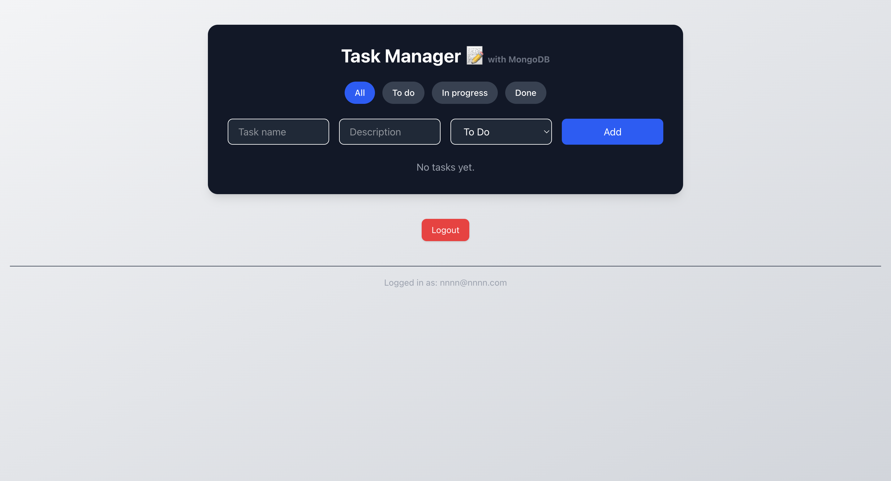

## 📝 Task Manager App (React + TypeScript + Tailwind)

# Live Demo 👉 https://task-manager-react-v2.vercel.app/

A simple and responsive task manager built with React, TypeScript, and Tailwind CSS. You can add, edit, delete, and filter tasks by status. All task operations are managed via a RESTful API connected to a MongoDB database for reliable data persistence.

## 🚀 Features

✅ Add new tasks

✏️ Edit existing tasks

❌ Delete tasks

🔄 Filter by status: To Do, In Progress, Done

🌐 Backend CRUD operations via a RESTful API

🗃️ Persistent storage using MongoDB

🎨 Fully styled with Tailwind CSS


## 📸 Preview

> _Add a screenshot here after styling is done_





```bash
```

## 🔧 Tech Stack
# Frontend

⚛️ React (Vite)

⛑️ TypeScript

🎨 Tailwind CSS

# Backend

🌐 Express.js

💾 MongoDB (via Mongoose)

📡 REST API for CRUD operations


## 🛠️ Getting Started

1. Clone the repo
git clone https://github.com/wesleyajavon/task-manager-react-v2.git
cd task-manager

2. Install dependencies
npm install

3. Start the development server
npm run dev

4. Start Backend
cd backend
npm install
npm run dev


Open http://localhost:5173 to view it in the browser.

